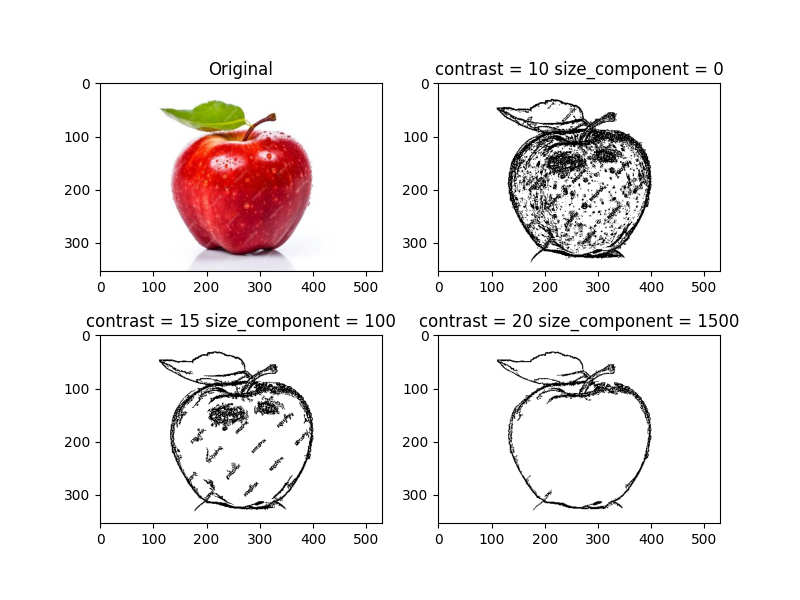

# Алгоритм выделения контура изображения

## Пример работы алгоритма

## Как это работает?
Сложность работы алгоритма `O(n * m)`, где `n * m` - размер исходного изображения.

Этапы алгоритма:

1. Перевод изображения в массив размерностью `(n, m, 3)`, каждый пиксель изображения имеет три цветовых канала.
2. Вычисление матрицы яркости изображения.
3. Вычисление матрицы контрастности изображения.
4. Нахождение компонент связностей контрастных пикселей, прилегающих друг к другу.
5. Удаление компонент связностей с малым числом пикселей.
6. Создание массива контурного изображения.
7. Перевод массива контурного изображения в контурное изображение.

На вычисление матрицы контрастности и удаления компонент связностей влияют параметры `contrast` и `size_component` соответственно.

## Реализация и демонстрация
Алгоритм реализован в [contour_detection.py](contour_detection.py) c использованием NumPy и PIL.Image. Второе используется исключительно для хранения изображений и перевода массивов в изображения.

Матрицы яркости и контрастности вычисляются путём простого обхода всех пикселей. Нахождение компонент связностей контрастных пикселей осуществляется при помощи bfs (поиск в ширину).

Примеры работы алгоритма с другими изображениями, измерение времени работы алгоритма, а также сравнение результатов работы contour_detection с PIL.ImageFilter представлены в [notebook_cd.ipynb](notebook_cd.ipynb).